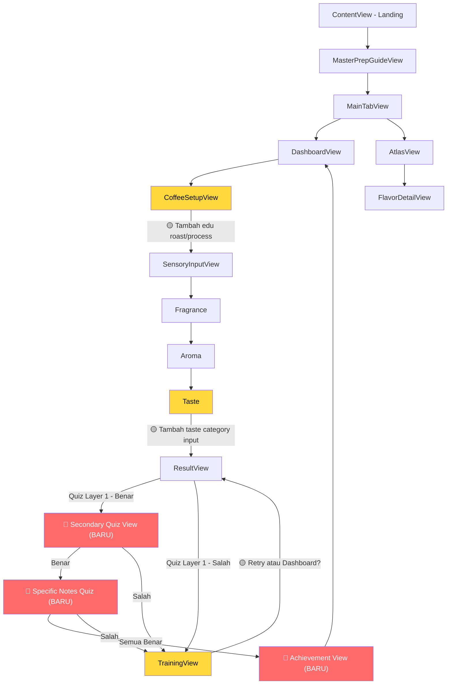

# Review: KopiJuang Flow Analysis

## Verdict: Apakah Sudah Jelas?

**Ya, secara keseluruhan flow-nya sudah sangat jelas dan well-documented.** Saya bisa memahami:
- Siapa target user-nya (newbie barista)
- Apa core loop-nya (sesi kopi → evaluasi → quiz → badge/training)
- Bagaimana navigasi antar screen bekerja
- Apa saja data yang mengalir dari screen ke screen

Dokumentasi ini jauh lebih baik dari rata-rata project context yang biasa saya lihat. Poin plus besar untuk:
- Penjelasan per-step yang detail (state, UI, navigasi)
- Diagram navigasi di bagian akhir
- Pemisahan yang jelas antara "apa yang sudah jalan" vs "apa yang masih mock"

---

## Gap Kritis: Core Experience vs Implementasi

Ada **gap besar** antara apa yang ditulis di "Core Experience" (poin 11-13) dengan view yang sudah didokumentasikan.

### Yang Ditulis di Core Experience (Poin 11-13)

```
11. Jika benar → badge unlocked → ditanya mau tebak secondary taste
12. Jika benar secondary → lanjut ke layer terluar (specific notes)
13. Jika semua benar → badge khusus + halaman pencapaian
```

Ini menggambarkan **cascading quiz 3 layer** berdasarkan SCA Flavor Wheel:
```
Layer 1: Fruity (primary/dominant)
  └── Layer 2: Berry, Dried Fruit, Citrus Fruit, Other Fruit (secondary)
       └── Layer 3: Blueberry, Blackberry, Strawberry, Raspberry (specific)
```

### Yang Ada di Implementasi

`ResultView` hanya punya **1 layer quiz** — pilih `FlavorCategory` dominan, lalu:
- Benar → feedback + badge message
- Salah → training

**Tidak ada view atau model untuk:**
- Quiz secondary taste
- Quiz specific notes (layer terluar)
- Halaman pencapaian setelah menebak semua layer
- Badge model yang menyimpan progress per-layer

> [!IMPORTANT]
> Ini adalah gap terbesar di dokumen. Core experience menjanjikan depth yang belum tercermin di arsitektur view dan model. Perlu diputuskan: apakah ini roadmap masa depan, atau memang harus dibangun sekarang?

---

## Masalah Logika Quiz

### "Jawaban Benar" Ditentukan dari `aromaCategory`

Saat ini:
```swift
correctCategory = evaluation.aromaCategory
```

Ini berarti jawaban "benar" di quiz taste **bukan ditentukan dari apa yang user rasakan saat minum**, melainkan dari apa yang user sendiri pilih sebagai kategori aroma wet. Ini menciptakan beberapa masalah:

| Skenario | Masalah |
|----------|---------|
| User pilih aroma = Fruity, lalu di quiz juga pilih Fruity | Selalu benar, karena user cuma mengulang jawaban sendiri |
| User pilih aroma = Nutty, tapi taste metrics menunjukkan acidity tinggi + sweetness rendah | Quiz bilang "benar" padahal metric-nya inkonsisten |
| User asal pilih aroma, lalu tebak sesuai pilihan aroma | Sistem reward tanpa validasi pemahaman |

### Rekomendasi

Ada beberapa opsi untuk memperbaiki ini:

**Opsi A — Heuristic dari Taste Metrics**
Tentukan `correctCategory` berdasarkan pola metric:
- Acidity tinggi + sweetness sedang → Fruity
- Sweetness tinggi + bitterness rendah → Sweet
- Body tebal + bitterness sedang → Nutty
- Acidity rendah + sweetness tinggi + body ringan → Floral

Ini membuat quiz jadi meaningful karena user harus benar-benar merasakan, bukan mengulang pilihan.

**Opsi B — Blend Aroma + Taste**
Gunakan weighted combination dari aroma category DAN taste metrics. Jika keduanya sejalan, confidence tinggi. Jika tidak, beri feedback yang lebih nuanced.

**Opsi C — Tetap Pakai Aroma, Tapi Reframe**
Jika memang sengaja, ubah pertanyaan quiz dari "rasa apa yang paling dominan saat minum?" menjadi "menurut kamu, kategori apa yang paling menggambarkan kopi ini secara keseluruhan?" — ini lebih konsisten dengan jawaban berbasis aroma.

---

## Hal yang Disebutkan Tapi Belum Ada di View

| Disebutkan di | Detail | Status |
|---------------|--------|--------|
| Core Experience poin 6 | Info di bawah picker roast/process tentang efek masing-masing level | ❌ Tidak ada di `CoffeeSetupView` |
| Core Experience poin 11 | Badge atas notes yang di-unlock, bisa diakses dari Flavor Atlas | ❌ Tidak ada Badge model |
| Core Experience poin 11-12 | Secondary taste quiz flow | ❌ Tidak ada view |
| Core Experience poin 13 | Halaman pencapaian setelah menebak semua | ❌ Tidak ada view |
| Core Experience poin 14 | Atlas menampilkan deskripsi, gambaran, contoh kopi | ⚠️ Partial, `FlavorDetailView` ada tapi konten generic |

---

## Improvement Suggestions

### 1. 🔴 Bangun Infrastruktur Gamification

Saat ini badge/unlock hanya berupa string di feedback. Untuk menghubungkan quiz → atlas → progression, minimal perlu:

```swift
// Model untuk tracking progress user
struct UserProgress: Codable {
    var unlockedPrimaryNotes: Set<FlavorCategory>    // Layer 1
    var unlockedSecondaryNotes: Set<String>           // Layer 2: "Berry", "Citrus Fruit"
    var unlockedSpecificNotes: Set<String>            // Layer 3: "Blueberry", "Raspberry"
    var completedSessions: [CompletedSession]
    var totalCorrectGuesses: Int
    var badges: [Badge]
}

struct Badge: Identifiable, Codable {
    let id: UUID
    let name: String          // "Fruity Explorer"
    let category: String
    let layer: Int            // 1, 2, atau 3
    let dateEarned: Date
}
```

### 2. 🔴 Model Flavor Wheel Data

Untuk mendukung cascading quiz (poin 11-13), perlu data structure flavor wheel:

```swift
struct FlavorWheelNode: Identifiable {
    let id: String                    // "fruity", "berry", "blueberry"
    let name: String
    let description: String
    let layer: Int                    // 1, 2, 3
    let parent: String?              // nil untuk layer 1
    let children: [FlavorWheelNode]
}
```

Ini juga bisa jadi data source untuk `AtlasView` menggantikan mock data.

### 3. 🟡 Tambah Edukasi di Coffee Setup

Sesuai poin 6 core experience, di bawah picker roast/process, tampilkan info singkat:

```
Light Roast  → Acidity lebih terbaca, body ringan, notes origin lebih jelas
Medium Roast → Balance antara acidity dan body
Dark Roast   → Body tebal, bitterness dominan, notes roast (cokelat, smoky)

Natural  → Cenderung fruity, body lebih tebal, sweetness tinggi  
Washed   → Clean, acidity lebih jelas, notes lebih defined
Honey    → Di antara natural dan washed, sweetness menonjol
```

Ini membantu user membangun ekspektasi sebelum evaluasi — sesuai prinsip "edukatif sebelum input".

### 4. 🟡 Jelaskan Post-Training Flow

Setelah user selesai di `TrainingView` dan tap "Oke, aku sudah coba!", apa yang terjadi?

Saat ini: dismiss → kembali ke... mana? Tidak jelas apakah:
- Kembali ke `ResultView`?
- Kembali ke `DashboardView`?
- Bisa retry quiz?

**Saran:** Setelah training, beri opsi:
1. "Coba tebak lagi" → kembali ke quiz di ResultView
2. "Kembali ke Dashboard" → selesaikan sesi, simpan sebagai completed

### 5. 🟡 Pertimbangkan "Taste Category" Input

Di Step 3 (Taste), user hanya input metrics (acidity, sweetness, bitterness, body) tapi **tidak pernah diminta memilih kategori rasa**. Lalu tiba-tiba di Result ditanya "rasa apa yang dominan?"

**Saran:** Tambahkan satu input di akhir Taste step:
> "Setelah slurp, apa kesan pertama yang muncul di lidahmu?"
> [Fruity] [Floral] [Nutty] [Sweet]

Ini jadi bridge antara metric scoring dan categorical quiz, dan membuat transisi ke Result quiz lebih natural.

### 6. 🟢 FlavorCategory Terlalu Sempit

Saat ini hanya 4 kategori: Fruity, Floral, Nutty, Sweet.

SCA Flavor Wheel punya lebih banyak primary categories:
- **Spices** (cinnamon, clove, pepper)
- **Roasted** (tobacco, pipe tobacco, burnt)
- **Cereal** (grain, malt)
- **Green/Vegetative** (olive, raw, herb-like)
- **Sour/Fermented** (winey, whiskey, fermented)
- **Cocoa/Chocolate** (sering digabung ke Nutty, tapi distinct)

**Pertanyaan:** Apakah 4 kategori ini sengaja disederhanakan untuk newbie barista? Jika ya, ini masuk akal sebagai MVP — tapi perlu di-note bahwa nanti akan diperluas. Jika tidak, pertimbangkan minimal menambah **Spices** dan **Roasted** karena sering muncul di kopi Indonesia.

### 7. 🟢 State Management

Dokumen sudah mengidentifikasi bahwa semua data ephemeral. Untuk MVP yang bisa dipakai, minimal perlu:

```
Prioritas persistence:
1. UserProgress (unlock status, badges) → SwiftData atau @AppStorage JSON
2. CompletedSessions (riwayat) → SwiftData  
3. SensoryEvaluation history → SwiftData
```

Tanpa ini, setiap kali app ditutup, semua progress hilang — ini akan sangat frustrasi untuk user yang sudah unlock beberapa notes.

---

## Flow Diagram: Yang Sudah Ada vs Yang Perlu Ditambah



**Legend:** 🔴 = belum ada, perlu dibangun | 🟡 = ada tapi perlu improvement

---

## Ringkasan Prioritas

| # | Item | Prioritas | Alasan |
|---|------|-----------|--------|
| 1 | Persistence (SwiftData) | 🔴 Tinggi | Tanpa ini, app tidak usable — semua progress hilang |
| 2 | Fix quiz logic (`correctCategory`) | 🔴 Tinggi | Saat ini quiz tidak benar-benar menguji pemahaman |
| 3 | Cascading quiz (secondary + specific) | 🔴 Tinggi | Core experience poin 11-13 belum ada implementasi |
| 4 | Badge & unlock system | 🔴 Tinggi | Menghubungkan quiz → atlas → gamification |
| 5 | Edu info di CoffeeSetup | 🟡 Sedang | Sudah disebutkan di poin 6, tinggal implementasi |
| 6 | Post-training flow | 🟡 Sedang | User experience setelah training belum clear |
| 7 | Taste category input | 🟡 Sedang | Bridge antara metrics dan quiz |
| 8 | Expand FlavorCategory | 🟢 Rendah | Bisa ditambah bertahap |
| 9 | Flavor wheel data model | 🟢 Rendah | Dibutuhkan saat cascading quiz dibangun |

---

## Satu Hal yang Sangat Bagus

Prinsip UX "kesalahan bukan kegagalan, tapi arah belajar" itu **sangat kuat**. Ini membuat app terasa supportive, bukan judgmental. Pertahankan ini di semua flow baru yang akan dibangun — termasuk di secondary/specific quiz nanti. Jangan pernah ada state "gagal total", selalu ada path ke pembelajaran.
